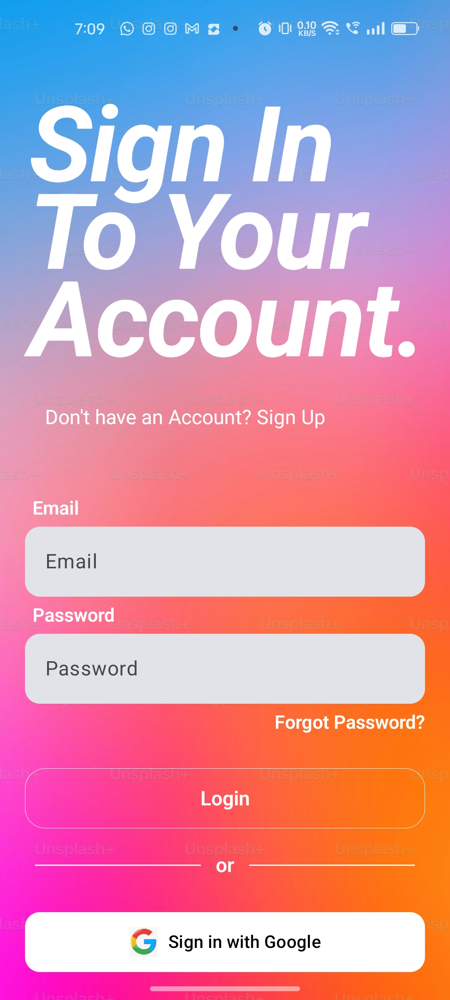
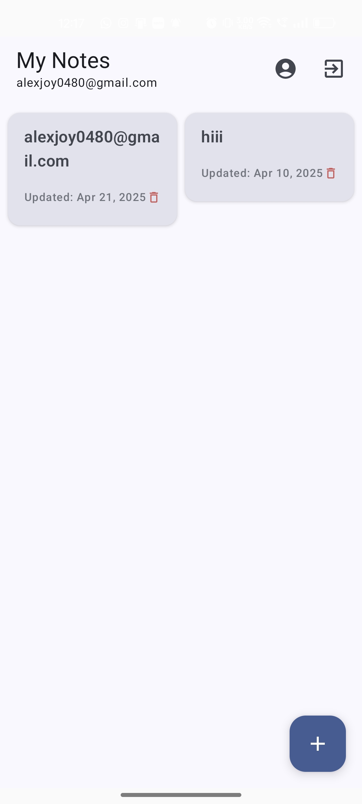
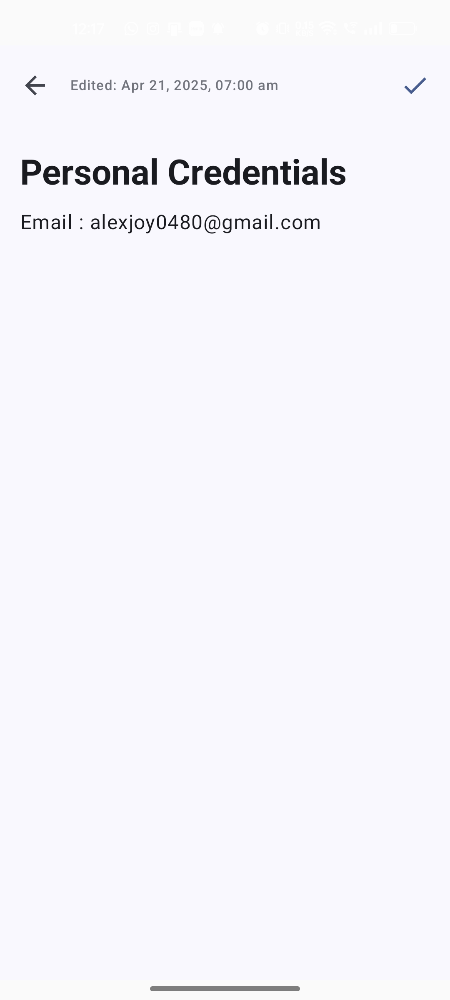

# Kotlin JetCompose Note App
[](https://opensource.org/licenses/MIT)

## 📖 Overview
A modern and secure **note-taking application** designed and built using **Google's Material You principles (Material 3)** for a clean, intuitive user experience. The app leverages **Jetpack Compose** for responsive UI, **Firebase Auth** for secure cloud-based authentication, and **Room DB** for reliable local data persistence for notes and user profiles.

## 🎥 Demo





## 🛠️ Tech Stack
- **Language:** Kotlin (version 2.0.21)
- **UI Framework:** Jetpack Compose (BOM 2025.03.01)
- **UI Design:** Material 3 (Material You principles)
- **Authentication:** Firebase Authentication (Firebase BOM 33.11.0)
- **Local Database:** Room DB (version 2.6.1)
- **Build System:** Gradle with Android Gradle Plugin (version 8.9.0)

## ✨ Features
- Secure user authentication with Firebase Auth.
- User profile management (name, username, DOB, gender) stored locally.
- Intuitive note management: create, view, edit, and delete notes.
- Fully responsive UI designed with Jetpack Compose.
- Local data storage with Room DB for offline access to notes and profiles.
- Clean and modern UI following Material You design guidelines.

## 🚀 Getting Started

### Prerequisites
Ensure you have the following installed:
- Android Studio (Latest version, Iguana or newer recommended)
- Kotlin 2.0.21+

### Installation
1. **Clone the repository**:
   ```bash
   git clone https://github.com/your-username/your-repository-name.git 
   # Replace with the actual URL of your repository
   ```
2. **Open the project in Android Studio**:
   - Navigate to the cloned directory.
   - Open the project folder.

3. **Set up Firebase**:
   - Create a Firebase project in the [Firebase Console](https://console.firebase.google.com/).
   - Enable Email/Password authentication in the Authentication section.
   - Download the `google-services.json` file from your Firebase project settings.
   - Place the downloaded `google-services.json` file in the `app/` directory of the project.

4. **Build and Run**:
   - Sync Gradle files in Android Studio.
   - Build and run the application on an emulator or physical device.

## 🏃 Usage
- **Create an Account**: Use Firebase Authentication to sign up securely.
- **Take Notes**: Add, edit, categorize, and delete notes effortlessly.
- **Offline Access**: Access notes stored locally with Room DB.

## 📄 License
This project is licensed under the MIT License. See the `LICENSE` file for details.

## 📞 Contact
Alex E J - [LinkedIn](https://www.linkedin.com/in/alexjoy89) - alexjoy0480@gmail.com
